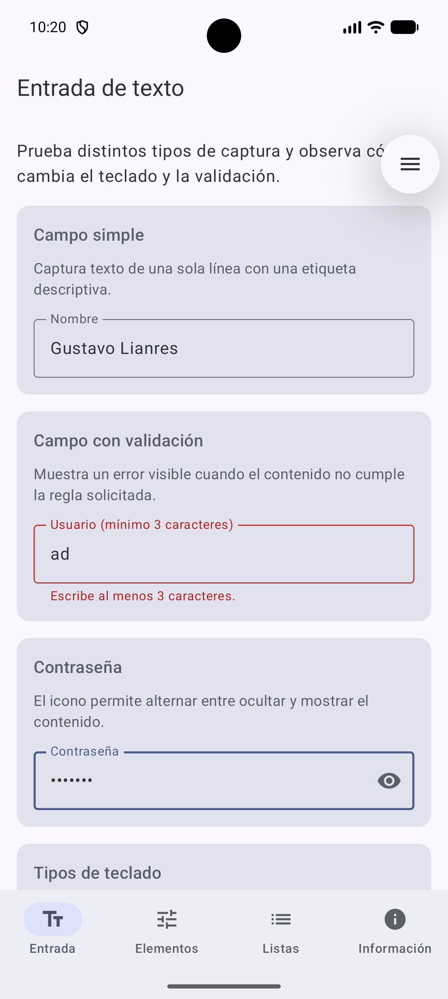
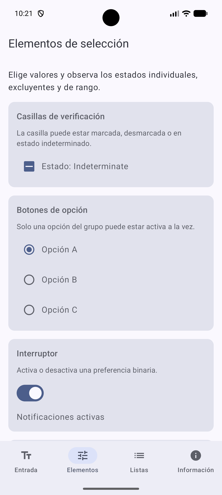
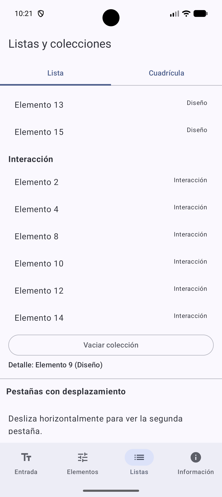
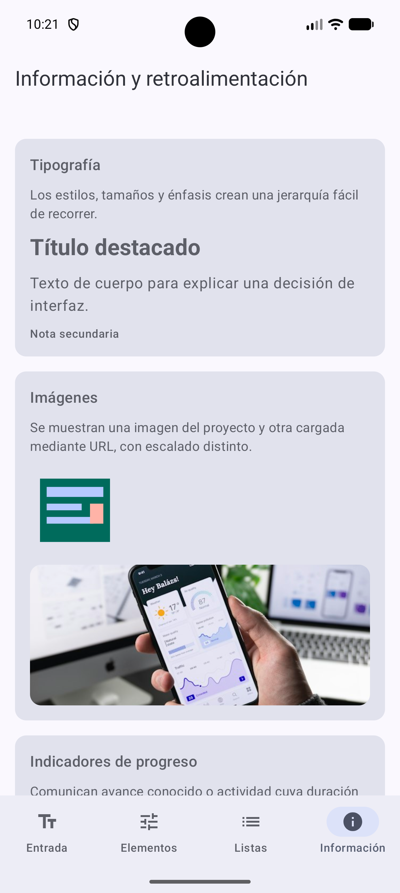
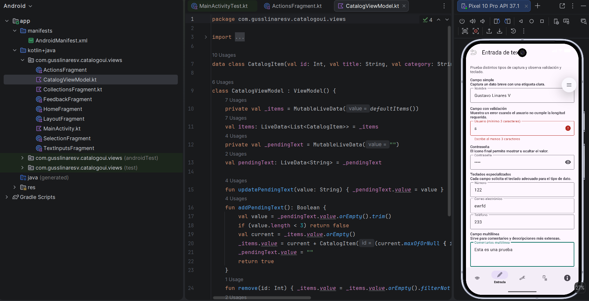
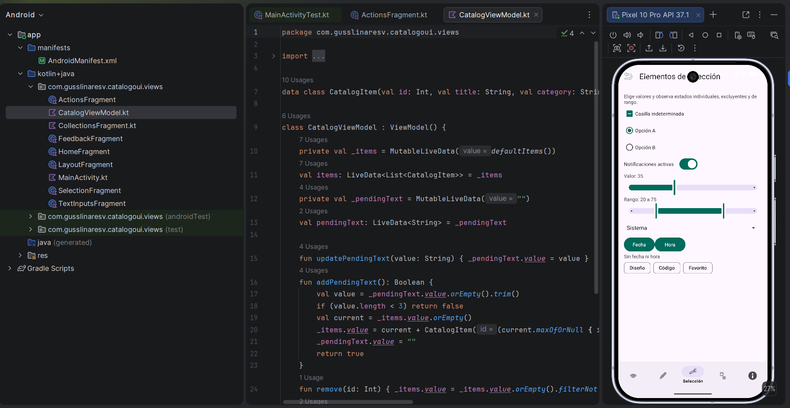
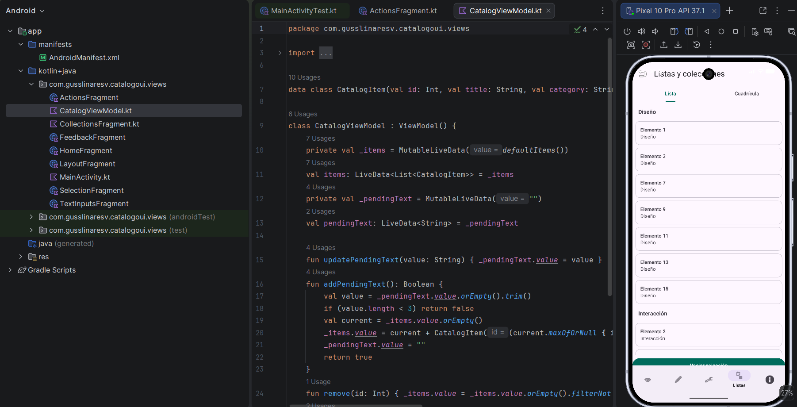
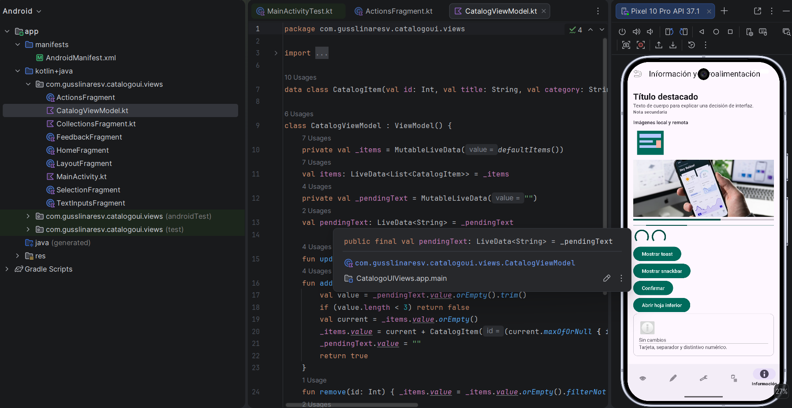
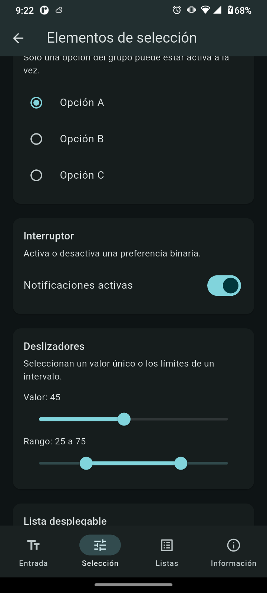
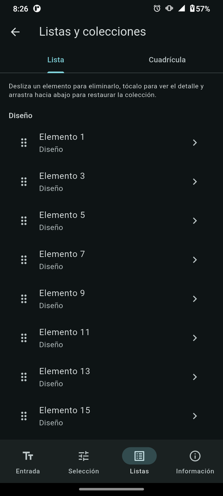

# Catálogo UI para dispositivos móviles

Catálogo interactivo de componentes de interfaz móvil implementado con Android Views/XML, Jetpack Compose y Flutter. Las tres aplicaciones mantienen las mismas seis categorías: entrada de texto, acciones, selección, colecciones, retroalimentación y estructura. Cada demostración está en español, responde a la interacción y se adapta al tema configurado en el sistema.

## Identificación

| Dato | Información |
| --- | --- |
| Nombre | Gustavo Lianres Villegas |
| Boleta | 2021630424 |
| Grupo | 7CV4 |

## Tecnologías y estructura

| Carpeta | Tecnología | Descripción |
| --- | --- | --- |
| `android-views/` | Kotlin, Views y XML | Pantallas con fragments, layouts XML y componentes Material. |
| `android-compose/` | Kotlin y Jetpack Compose | Pantallas declarativas con composables y Navigation Compose. |
| `flutter/` | Dart y Flutter Material 3 | Rutas Flutter con estado compartido mediante `ChangeNotifier`. |
| `docs/` | Markdown y capturas | Instrucciones de ejecución y evidencia visual. |
| `apk/` | Binarios Android | APK de depuración de las tres implementaciones. |

Las instrucciones detalladas de compilación, pruebas, APK y conexión de dispositivo están en [docs/INSTRUCCIONES_DE_COMPILACION.md](docs/INSTRUCCIONES_DE_COMPILACION.md).

## APK

- [Views/XML](apk/catalogo-ui-views.apk)
- [Jetpack Compose](apk/catalogo-ui-compose.apk)
- [Flutter para arm64-v8a](apk/catalogo-ui-flutter.apk)

## Tabla de equivalencias

| Elemento | Views/XML | Jetpack Compose | Flutter |
| --- | --- | --- | --- |
| Campo simple | `TextInputLayout` + `TextInputEditText` | `OutlinedTextField` | `TextField` |
| Validación y error | `TextInputLayout.error` | `OutlinedTextField` con `isError` | `TextField` con `errorText` |
| Contraseña visible u oculta | `TextInputLayout` con `password_toggle` | `PasswordVisualTransformation` | `obscureText` y botón de visibilidad |
| Teclados numérico, correo y teléfono | `inputType` | `KeyboardOptions` | `TextInputType` |
| Campo multilínea | `TextInputEditText` con `textMultiLine` | `OutlinedTextField` con varias líneas | `TextField` con `maxLines` |
| Sugerencias | `AutoCompleteTextView` | chips seleccionables | `Autocomplete` |
| Búsqueda | `EditText` con filtro | `OutlinedTextField` con filtro | `TextField` con filtro |
| Botón relleno | `MaterialButton` | `Button` | `FilledButton` |
| Botón con contorno | `MaterialButton` estilo outlined | `OutlinedButton` | `OutlinedButton` |
| Botón de texto | `MaterialButton` estilo text | `TextButton` | `TextButton` |
| Botón de solo ícono | `ImageButton` | `IconButton` | `IconButton` |
| Botón con ícono y texto | `MaterialButton` con `icon` | `Button` con `Icon` y `Text` | `FilledButton.icon` |
| FAB normal y extendido | `FloatingActionButton` y `ExtendedFloatingActionButton` | `FloatingActionButton` y `ExtendedFloatingActionButton` | `FloatingActionButton` y `FloatingActionButton.extended` |
| Alternancia o selector | `MaterialButtonToggleGroup` | `FilterChip` | `SegmentedButton` |
| Botón deshabilitado | `MaterialButton` deshabilitado | `Button` sin acción | `FilledButton` sin acción |
| Estado de carga | `ProgressBar` en botón | `CircularProgressIndicator` | `CircularProgressIndicator` |
| Casilla indeterminada | `MaterialCheckBox` | `TriStateCheckbox` | `CheckboxListTile` tristate |
| Opciones excluyentes | `RadioGroup` y `RadioButton` | `RadioButton` | `RadioListTile` |
| Interruptor | `MaterialSwitch` | `Switch` | `SwitchListTile` |
| Deslizador único | `Slider` | `Slider` | `Slider` |
| Deslizador de rango | `RangeSlider` | `RangeSlider` | `RangeSlider` |
| Lista desplegable | `Spinner` | `ExposedDropdownMenuBox` | `DropdownButtonFormField` |
| Fecha y hora | `DatePickerDialog` y `TimePickerDialog` | diálogos Android desde Compose | `showDatePicker` y `showTimePicker` |
| Chips de filtro | `ChipGroup` y `Chip` | `FilterChip` | `FilterChip` |
| Lista vertical | `RecyclerView` | `LazyColumn` | `ListView` |
| Cuadrícula | `RecyclerView` con `GridLayoutManager` | `LazyVerticalGrid` | `GridView.builder` |
| Encabezados de sección | tipos de vista en `RecyclerView` | elementos de encabezado en `LazyColumn` | encabezados en `ListView` |
| Detalle de elemento | `Snackbar` al seleccionar | texto de detalle | hoja inferior de detalle |
| Eliminar con gesto | `ItemTouchHelper` | gesto horizontal en elemento | `Dismissible` |
| Actualizar al arrastrar | `SwipeRefreshLayout` | estado de actualización de lista | `RefreshIndicator` |
| Estado vacío | `LinearLayout` alternable | `Column` condicional | widget `_EmptyCollection` |
| Pestañas deslizables | `TabLayout` + `ViewPager2` | `TabRow` | `TabBar` + `TabBarView` |
| Imagen local | `ImageView` | `Image` de recurso | `Image.asset` |
| Imagen URL | Coil en `ImageView` | `AsyncImage` de Coil | `Image.network` |
| Progreso lineal y circular | `ProgressBar` | `LinearProgressIndicator` y `CircularProgressIndicator` | indicadores lineal y circular |
| Toast y snackbar | `Toast` y `Snackbar` | `Toast` y `SnackbarHost` | `SnackBar` |
| Diálogo | `AlertDialog` | `AlertDialog` | `showDialog` |
| Hoja inferior | `BottomSheetDialog` | `ModalBottomSheet` | `showModalBottomSheet` |
| Tarjeta, separador y badge | `MaterialCardView`, `View`, `BadgeDrawable` | `Card`, `HorizontalDivider`, `Badge` | `Card`, `Divider`, `Badge` |
| Fila, columna y superposición | `LinearLayout` y `FrameLayout` | `Row`, `Column` y `Box` | `Row`, `Column` y `Stack` |
| Scroll vertical | `ScrollView` | `verticalScroll` | `SingleChildScrollView` |
| Barra superior y navegación | `MaterialToolbar` + `BottomNavigationView` | `TopAppBar` + `NavigationBar` | `AppBar` + `NavigationBar` |
| Restricciones o pesos | `ConstraintLayout` y `layout_weight` | `weight` | `Expanded` y `Flexible` |

## Evidencia visual

### Jetpack Compose

| Sección | Captura |
| --- | --- |
| Entrada de texto |  |
| Elementos de selección |  |
| Listas y colecciones |  |
| Información y retroalimentación |  |

### Android Views y XML

| Sección | Captura |
| --- | --- |
| Entrada de texto |  |
| Elementos de selección |  |
| Listas y colecciones |  |
| Información y retroalimentación |  |

### Flutter

| Sección | Captura |
| --- | --- |
| Elementos de selección |  |
| Listas y colecciones |  |

## Requisitos transversales

- Las tres implementaciones incluyen Inicio y navegación hacia las seis secciones.
- La interfaz usa textos en español y sigue el tema claro u oscuro del sistema.
- Cada sección muestra una explicación y controles interactivos, no imágenes decorativas.
- Un elemento válido escrito en Entrada se agrega a la colección de Listas.
- Las listas permiten selección, actualización y eliminación; las acciones presentan respuestas visibles.

## Reflexión final

Kotlin fue la tecnología más familiar por la sintaxis. Jetpack Compose permitió construir la interfaz con mayor rapidez gracias al enfoque declarativo y a la composición directa de controles. Flutter resultó el código más legible al concentrar widgets, estado y navegación en una estructura consistente. La principal dificultad del proyecto fue instalar y configurar correctamente los tres entornos para generar, ejecutar y probar cada aplicación.

## Referencias

- Google. (s. f.). *Build a user interface with layouts*. Android Developers. <https://developer.android.com/develop/ui/views/layout/declaring-layout>
- Google. (s. f.). *Jetpack Compose*. Android Developers. <https://developer.android.com/develop/ui/compose>
- Google. (s. f.). *Flutter documentation*. Flutter. <https://docs.flutter.dev/>
